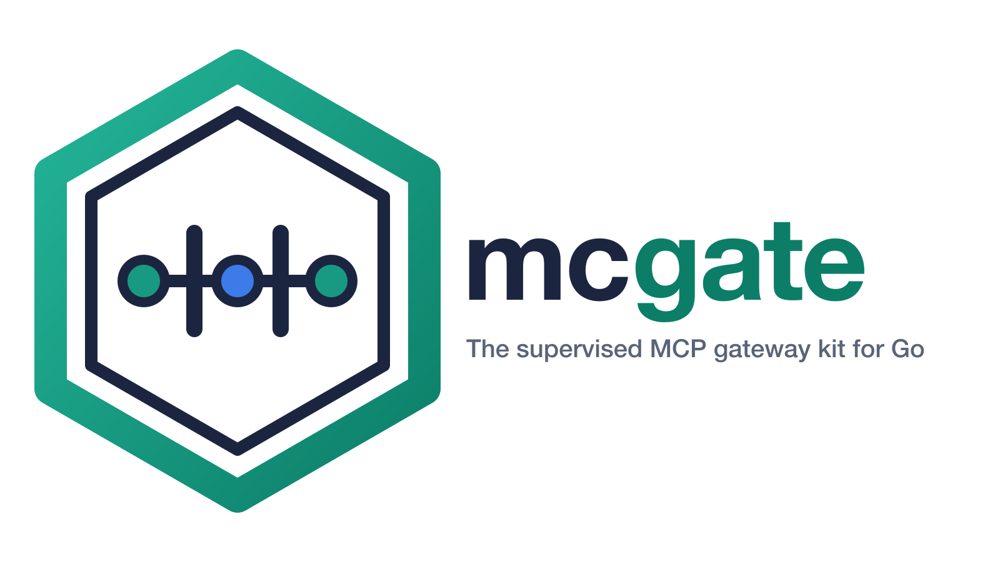
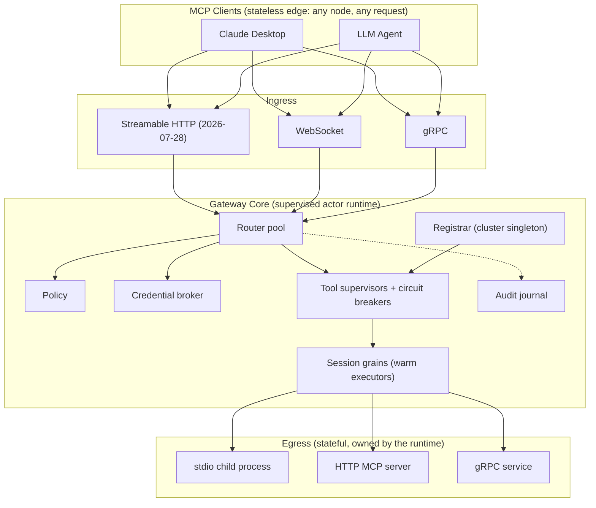

<h2 align="center">
  <br />
  The Supervised MCP Gateway Kit for Go
</h2>

<p align="center">
  <a href="https://github.com/Tochemey/mcgate/actions/workflows/gha-pipeline.yml"></a>
  <a href="https://pkg.go.dev/github.com/tochemey/mcgate"></a>
</p>

> **Project status:** Early-stage and opinionated, not yet running in a named production deployment. I'm looking for design partners willing to run it in real workloads and shape it from there. Maintained on a best-effort basis; if you depend on it today, expect to carry patches for anything time-sensitive.

## Overview

The MCP 2026-07-28 specification removes protocol sessions: there is no handshake and no `Mcp-Session-Id`, and every request is self-contained and can be routed to any server instance. That does not remove the state. A stdio tool is a child process that has to be spawned, supervised, and killed. An HTTP backend holds warm connections. Circuit state, credential caches, and quota counters have to live somewhere and survive the request that created them.

**mcgate** owns that state. It is an MCP gateway library for Go with a stateless protocol edge and a supervised, stateful execution core built on the [GoAkt](https://github.com/Tochemey/goakt) actor framework. Any node accepts any request, and the actor runtime routes it to the tool's warm executor, applying tenancy, policy, credential, circuit breaking, and audit controls along the way.

## Table of Contents

- [Why the name?](#why-the-name)
- [Why](#why)
- [Installation](#installation)
- [Quickstart](#quickstart)
- [Architecture](#architecture)
- [Feature tour](#feature-tour)
- [MCP spec coverage](#mcp-spec-coverage)
- [Examples](#examples)
- [Contributing](#contributing)

## Why the name?

**mcgate** is short for "MCP gateway". The name also describes the design: every tool sits behind its own gate with its own machinery (a supervisor, a circuit breaker, admission control), so the gateway can close the gate on a failing tool while every other gate stays open. mcgate is a library rather than a deployable server. It supplies the gates; you supply the policy, credentials, quotas, and audit behind interfaces you implement in your own binary.

## Why

- **Per-tool failure containment** : every tool has a supervisor actor with its own circuit breaker. A crashed child process or a flapping backend degrades one tool, not the gateway, and failed executors are rebuilt and retried within the request.
- **Stateless edge, supervised core** : ingress follows MCP 2026-07-28 (self-contained requests, plain load balancers) while executor, session, and circuit state live in named actors the runtime owns.
- **Enterprise controls in-process** : OAuth 2.0 Bearer validation with RFC 9728 discovery, tenant-scoped tool visibility, per-tenant quotas, pluggable policy, credential brokering per tenant and tool, and a durable audit trail, all inside your own binary behind interfaces you implement.
- **Any transport, both directions** : serve MCP clients over Streamable HTTP, WebSocket, or gRPC; invoke backends over stdio child processes, HTTP, or gRPC (descriptor sets or server reflection), including streaming progress.
- **Cluster mode** : any node accepts any request; tool supervisors and session grains are placed across the cluster and relocate on node loss, so warm executors keep serving wherever they live.

## Installation

```bash
go get github.com/tochemey/mcgate
```

Requires Go 1.26+. Public domain types live in the `mcp` package; the root `mcgate` package exposes the `Gateway`.

## Quickstart

```go
package main

import (
	"context"
	"net/http"

	"github.com/tochemey/mcgate"
	"github.com/tochemey/mcgate/mcp"
)

type identity struct{}

func (identity) ResolveIdentity(*http.Request) (mcp.TenantID, mcp.ClientID, error) {
	return "default", "default", nil // plug in your auth here
}

func main() {
	gw, err := mcgate.New(mcp.Config{
		Tools: []mcp.Tool{{
			ID:        "filesystem",
			Transport: mcp.TransportStdio,
			Stdio: &mcp.StdioTransportConfig{
				Command: "npx",
				Args:    []string{"-y", "@modelcontextprotocol/server-filesystem", "/tmp"},
			},
		}},
	})
	if err != nil {
		panic(err)
	}

	ctx := context.Background()
	if err := gw.Start(ctx); err != nil {
		panic(err)
	}
	defer gw.Stop(ctx)

	handler, err := gw.Handler(mcp.IngressConfig{IdentityResolver: identity{}})
	if err != nil {
		panic(err)
	}
	_ = http.ListenAndServe(":8080", handler)
}
```

Point any MCP client at `http://localhost:8080` to use the filesystem server's tools. The gateway spawns the child process, supervises it, and applies circuit breaking. The [filesystem example](examples/filesystem) is the runnable version of this.

## Architecture

The gateway has three layers: stateless ingress, an actor-runtime core, and stateful egress. Supervised actors own the state boundary.



Every invocation goes through tool lookup, policy evaluation, circuit admission, credential resolution, and the session grain before reaching the backend, with audit events and OpenTelemetry signals emitted along the way.

## Feature tour

- **Transports** : stdio, HTTP, and gRPC egress (gRPC with proto descriptor sets or server reflection); Streamable HTTP, WebSocket, and gRPC ingress with streaming progress (`InvokeStream`). See [ingress](examples/ingress) and [ingress-grpc](examples/ingress-grpc).
- **Tenancy & auth** : OAuth 2.0 Bearer validation (`TokenVerifier`, `IdentityMapper`, RFC 9728 metadata, gRPC interceptors), tenant-scoped tool listing, per-tenant rate and concurrency quotas, pluggable `PolicyEvaluator`. See [admin-policy](examples/admin-policy) and [quota-assess](examples/quota-assess).
- **Credentials** : `CredentialsProvider` resolves secrets from any source (vault, env, KMS) per tenant and tool. Values are injected into the backend transport (env vars for stdio, headers for HTTP, metadata for gRPC) with a bounded LRU cache. See [ai-hub](examples/ai-hub).
- **Resilience** : per-tool circuit breakers with half-open probing, transparent executor recovery with in-request retry, per-tool session caps, periodic health probing, idle-session passivation. Client disconnects never trip a breaker.
- **Observability** : OpenTelemetry traces and metrics via the global providers (bring your own exporter), W3C trace-context propagation on egress, structured logging with correlation fields, and a durable audit trail with a pluggable `AuditSink` and configurable overflow policy. See [audit-http](examples/audit-http).
- **Dynamic management** : register, update, enable, disable, drain, and remove tools at runtime through the [admin API](https://pkg.go.dev/github.com/tochemey/mcgate). Schemas and resources are discovered from backends and cached at registration.
- **Cluster mode** : gossip membership, TLS remoting, pluggable peer discovery (Kubernetes provider in [cluster](examples/cluster)). The registrar singleton holds metadata only; tool supervisors spread round-robin across nodes and relocate when a node leaves (circuit state resets on relocation; a relocated supervisor re-learns backend health from live traffic). Cross-node invocations route to the node owning the warm executor; cross-node `InvokeStream` degrades to a final-result-only response. Recommended topology: three nodes (replica count 2).

Full API and configuration reference: [pkg.go.dev/github.com/tochemey/mcgate](https://pkg.go.dev/github.com/tochemey/mcgate).

## MCP spec coverage

| Surface                                                        | Status                                                                |
|----------------------------------------------------------------|-----------------------------------------------------------------------|
| `tools/list`, `tools/call` (+ streaming progress)              | Supported                                                             |
| `resources/list`, `resources/templates/list`, `resources/read` | Supported                                                             |
| Stateless protocol edge (2026-07-28)                           | Supported; previous-revision clients are served through the same path |
| Enterprise-managed authorization extension                     | Supported                                                             |
| `prompts/list`, `prompts/get`                                  | Planned                                                               |
| `resources/subscribe`, sampling                                | Planned                                                               |
| SSE transport                                                  | Removed (superseded by the 2026-07-28 spec)                           |

Egress still speaks the previous protocol revision to backends, so backend servers do not need to upgrade.

## Examples

| Example                                                                       | Shows                                                                    |
|-------------------------------------------------------------------------------|--------------------------------------------------------------------------|
| [filesystem](examples/filesystem)                                             | Minimal gateway in front of a stdio MCP server                           |
| [ingress](examples/ingress) / [ingress-grpc](examples/ingress-grpc)           | HTTP and gRPC ingress, streaming                                         |
| [ai-hub](examples/ai-hub)                                                     | End-to-end multi-tenant hub: policy, credentials, audit, OTel, admin API |
| [admin-policy](examples/admin-policy) / [quota-assess](examples/quota-assess) | Policy evaluation and tenant quotas                                      |
| [audit-http](examples/audit-http)                                             | Durable audit trail over HTTP ingress                                    |
| [full-config](examples/full-config)                                           | Every configuration surface in one place                                 |
| [cluster](examples/cluster)                                                   | Three-node Kubernetes cluster with peer discovery and tracing            |

[ai-hub](examples/ai-hub) is the recommended starting point for how the pieces fit together.

## Contributing

Contributions are welcome. See the [Contributing Guide](CONTRIBUTING.md).
